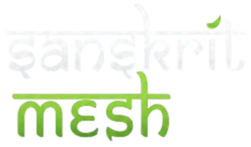

#  Sanskrit-Mesh

<div align="center">



<br/><br/>


<br/><br/>

<h3>Stop paying for tokens your agents waste being polite to each other.</h3>

<p>
Sanskrit-Mesh compresses LLM agent payloads 55-77% using a Paninian Intermediate Representation.<br/>
Lossless. Drop-in. Works with LangChain, AutoGen, and any OpenAI-format API.
</p>

<pre>pip install sanskrit-mesh</pre>

<p>
<a href="#live-benchmark">Benchmarks</a> |
<a href="#quickstart">Quickstart</a> |
<a href="#roadmap">Roadmap</a> |
<a href="CONTRIBUTING.md">Contributing</a>
</p>

</div>

---

`Sanskrit-Mesh` is an AI-native bytecode compiler for **multi-agent LLM pipelines**. It intercepts the structured payloads that frameworks like AutoGen, LangChain, and CrewAI generate automatically — agent messages, memory objects, tool calls, system prompts — and compresses them into an ultra-dense Intermediate Representation (IR) inspired by Panini's Sanskrit grammar. On the other side, it decompiles back to perfect English with zero data loss.

**Result: 55-77% token reduction on agent-generated payloads. Zero logic changes to your pipeline.**

| Payload Type | Before | After | Saving |
|---|---|---|---|
| System prompt | 373 chars | 87 chars | **76.7%** |
| Agent message | 232 chars | 88 chars | **62.1%** |
| LangChain memory | 864 chars | 379 chars | **56.1%** |
| ReAct scratchpad | 656 chars | 335 chars | **48.9%** |

*Run `python benchmark.py` to verify these numbers yourself.*

---

## What V1 Does and Doesn't Do

Read this before installing. No surprises.

**V1 delivers:**
- Compresses JSON keys, framework boilerplate, error messages, status fields, and system prompts
- Works with AutoGen, LangChain, or any OpenAI-format API
- 100% lossless — `python validator.py` proves it on your machine
- System prompt compression saves tokens on every single API call, not just multi-agent runs
- Extends effective context window for local LLM users running agent pipelines

**V1 does not deliver:**
- Compression of freeform human text — a user typing "deploy my app" saves nothing
- Inference speed improvements — model loading and generation speed are unchanged
- Model size reduction — this is not quantization
- Meaningful savings for simple chatbot use cases with no agent structure

**Who gets real value from V1:**
- Developers running AutoGen, CrewAI, or LangChain agent pipelines against paid APIs
- Developers with large repetitive system prompts sent on every call
- Local LLM users running agent pipelines on hardware with tight context windows (4K-8K)

**Who won't see much benefit:**
- Apps where most traffic is freeform human conversation
- Single-turn prompt/response use cases with no agent structure
- Anyone not using a framework that generates structured payloads

---

## Honest Answers to the Obvious Criticisms

**"This is just a find-and-replace script with a fancy name."**

Partially fair. The dictionary layer is a lookup table — that's true. What makes it more than that: the key minification layer is structural (works on any JSON regardless of content), the round-trip fidelity is guaranteed and verifiable, and the IR is designed as a protocol, not a one-off abbreviation. The dictionary is open for community contribution, so it grows with real agent traffic patterns. Run `python validator.py` to see exactly what matches and why.

**"LLMLingua already does this, and better."**

For compressing arbitrary human text, yes. Sanskrit-Mesh targets structured machine-generated payloads that frameworks produce automatically. They are complementary. LLMLingua integration is planned for V2.

**"The dictionary is too small for production use."**

200+ entries covers common framework patterns well. Coverage drops on unusual custom patterns. Adding entries is one dict line — see `CONTRIBUTING.md`. The more the community uses it, the better it gets.

**"How do I know the LLM still understands the compressed payload?"**

The middleware decompresses back to full English before the LLM ever sees it. The LLM always receives normal text. Run `python validator.py` for byte-perfect proof on your own payloads.

**"Token prices keep dropping anyway."**

True. But context window limits don't — especially on local models. The context extension use case gets stronger as more people run models locally on limited hardware.

---

## The Problem

Multi-agent systems auto-generate repetitive structured payloads on every step:

```json
{
  "sender": "Agent A",
  "receiver": "Agent B",
  "intent": "Request Clarification",
  "context": {
    "status": "failed",
    "message": "I encountered the following error: NullPointerException: object reference not set. Please advise on how to proceed."
  }
}
```

*232 characters. Sent hundreds of times per pipeline run. You never wrote this — your framework did.*

## The Solution

Sanskrit-Mesh compresses it to:

```json
{"s":"|AgA|","r":"|AgB|","i":"|Prashna|","c":{"st":"|F|","m":"|E:| |ShunyaDosha|. |?|"}}
```

*88 characters. Same meaning. **62% smaller.***

Three compression layers:
1. **Key minification** — JSON keys shrunk to 1-3 chars (`"sender"` to `"s"`)
2. **Semantic IR dictionary** — 200+ agent phrases mapped to dense Sanskrit tokens
3. **Whitespace stripping** — removes bloat agents auto-generate

---

## Why Paninian Grammar?

Panini formalized Sanskrit grammar 2,500 years ago into the most concise, unambiguous linguistic rule system ever written. It encodes complex meaning in single dense constructs — exactly what machine-to-machine communication needs. `MemoryError: out of memory` becomes `SmritiBhara`. `ConnectionError: failed to establish connection` becomes `BandhanDosha`. Dense, unambiguous, lossless.

---

## Installation

```bash
pip install sanskrit-mesh
```

With framework integrations:

```bash
pip install sanskrit-mesh[langchain]
pip install sanskrit-mesh[autogen]
pip install sanskrit-mesh[all]
```

No hard dependencies in the base install.

---

## Quickstart

### Universal — Works With Any OpenAI-Format API

```python
from middleware import SanskritMeshMiddleware

middleware = SanskritMeshMiddleware()

messages = [
    {"role": "system",    "content": "You are a helpful, harmless, and honest assistant. Think step by step before answering. Always respond in JSON format."},
    {"role": "assistant", "content": "I will execute the tool to deploy. The deployment failed. Running again..."},
    {"role": "tool",      "content": "I encountered the following error: ConnectionError: failed to establish connection. Please advise on how to proceed."},
]

compressed = middleware.compress_messages(messages)

response = openai_client.chat.completions.create(
    model="gpt-4o",
    messages=compressed
)

print(middleware.get_savings_report())
```

### System Prompt Compression

```python
from middleware import SanskritMeshMiddleware

middleware = SanskritMeshMiddleware()

system_prompt = (
    "You are a helpful, harmless, and honest assistant. "
    "You are operating in a multi-agent environment. "
    "Think step by step before answering. "
    "Always respond in valid JSON. "
    "Your goal is to complete the assigned task efficiently."
)

compressed = middleware.compress_system_prompt(system_prompt)
# Result: |sys:hhh| |sys:multi| |sys:CoT| |sys:json+| |sys:goal|
# 315 chars to 74 chars. 76.5% smaller. Runs on every call.
```

### LangChain Integration

```python
from middleware import SanskritMeshLangChainCallback
from langchain_openai import ChatOpenAI

callback = SanskritMeshLangChainCallback(verbose=True)
llm = ChatOpenAI(model="gpt-4o", callbacks=[callback])

response = llm.invoke("Deploy the application.")
print(callback.get_session_report())
```

### AutoGen Integration

```python
from middleware import SanskritMeshAutoGenHook
import autogen

hook = SanskritMeshAutoGenHook(verbose=True)

planner  = autogen.ConversableAgent("PlannerAgent", ...)
executor = autogen.ConversableAgent("ExecutorAgent", ...)

planner.register_hook(
    hookable_method="process_message_before_send",
    hook=hook.compress_hook
)
```

### Raw Compiler

```python
from compiler import SanskritMeshCompiler

compiler = SanskritMeshCompiler()

payload = {
    "intent": "Request Clarification",
    "message": "I encountered the following error: IndexError: list index out of range. Please advise on how to proceed."
}

compressed = compiler.compile_payload(payload)
# {'i': '|Prashna|', 'm': '|E:| |KramaBhanga|. |?|'}

restored = compiler.decompile_payload(compressed)
assert restored == payload  # 100% lossless
```

---

## Live Benchmark

```bash
python benchmark.py
```

Test your own payload:

```bash
python benchmark.py --payload '{"role": "system", "content": "You are a helpful assistant. Think step by step."}'
```

### Real Benchmark Results (V1)

| Benchmark | Original | Compressed | Saving |
|---|---|---|---|
| Simple agent message | 232 chars | 88 chars | **62.1%** |
| System prompt | 373 chars | 87 chars | **76.7%** |
| LangChain memory / chat history | 864 chars | 379 chars | **56.1%** |
| Complex nested multi-agent payload | 833 chars | 374 chars | **55.1%** |
| ReAct agent scratchpad | 656 chars | 335 chars | **48.9%** |
| Worst case (zero dictionary matches) | 245 chars | 236 chars | 3.7% |

**Real-world average on agent-generated traffic: ~59-62%**

---

## Cost Savings at Scale

Based on real benchmark averages, GPT-4o at $5/1M tokens:

| Monthly API Calls | Avg Token Reduction | Monthly Savings |
|---|---|---|
| 10,000 | 59% | ~$7 |
| 100,000 | 59% | ~$74 |
| 1,000,000 | 59% | ~$740 |
| 10,000,000 | 59% | ~$7,400 |

---

## For Local LLM Users (Low-End PCs)

If you run agent pipelines locally via Ollama or llama.cpp, Sanskrit-Mesh extends your effective context window on the structured parts of your conversation. A 4K context model running an AutoGen pipeline gets more turns before hitting the limit.

This does **not** help casual local chat — savings only apply to agent-structured messages.

```python
import ollama
from middleware import SanskritMeshMiddleware

middleware = SanskritMeshMiddleware()
messages = [...]
compressed = middleware.compress_messages(messages)
response = ollama.chat(model="llama3.2", messages=compressed)
```

---

## V2 Plans

**Human prompt compression** — LLMLingua integration so freeform user messages get compressed too.

**Adaptive dictionary** — learns compression patterns from your own agent traffic automatically.

**Sanskrit-Mesh-3B** — a fine-tuned small model that natively reads and writes IR without any decompilation step. The model thinks in compressed form. Same intelligence, smaller context footprint.

**CrewAI integration** and **Ollama / llama.cpp plugin**.

---

## Roadmap

- [x] Core compiler with 200+ IR dictionary entries
- [x] System prompt compression
- [x] LangChain callback integration
- [x] AutoGen hook integration
- [x] Universal OpenAI-format middleware
- [x] Live benchmark tool with cost reporting
- [x] Round-trip validator (`python validator.py`)
- [x] PyPI package (`pip install sanskrit-mesh`)
- [x] Contribution guide
- [ ] CrewAI integration
- [ ] 500+ dictionary entries
- [ ] Adaptive dictionary from real traffic
- [ ] Human prompt compression via LLMLingua
- [ ] Fine-tuned Sanskrit-Mesh-3B model
- [ ] Ollama / llama.cpp plugin

---

## Contributing

The dictionary grows with the community. Adding an entry is one line of Python. See [CONTRIBUTING.md](CONTRIBUTING.md).

## Release readiness

V2 is being prepared as a release-ready package with:
- a documented IR contract and versioning policy
- validator-based regression coverage
- linguistic and multilingual compression rules with round-trip tests
- rollout guidance and privacy safeguards

See [docs/release-checklist.md](docs/release-checklist.md) and [docs/privacy-and-rollout.md](docs/privacy-and-rollout.md) for the rollout plan.

---

## License

## Examples

Small integration examples ship in `examples/` to demonstrate the transformer/adapters.

- `examples/langchain_example.py` — LangChain transformer demo (defensive import).
- `examples/llamaindex_example.py` — LlamaIndex adapter demo (defensive import).

Run them with:

```
python examples/langchain_example.py
python examples/llamaindex_example.py
```

These examples exercise the transform/compile path and should work in
environments without the external libraries because integrations use
defensive imports.

---

MIT — free forever. Stop paying OpenAI to read your agents' polite greetings.
